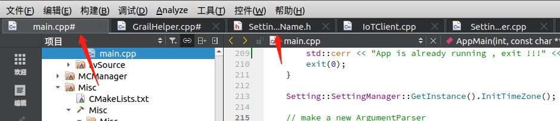

# Qt Creator Tabbed Editor Plugin

[mod]   
1/add pin/unpin function;   
2/auto move to  the right place;   
3/auto shrink long name by ...;    
4/add plog for debug easy;   
5/now, tab just like vscode .   

The aim of this project is to provide a tab-based experience in [Qt Creator](http://qt-project.org/wiki/Category:Tools::QtCreator).

## Copyright / License

Copyright (C) 2015 Oleg Shparber

This software is available under the terms of the GNU Lesser General Public License version 3 (LGPLv3).

This project is a fork of [QtCreator Tabbed Editor Plugin](https://sourceforge.net/projects/tabbededitor/) by SNA Soft.
